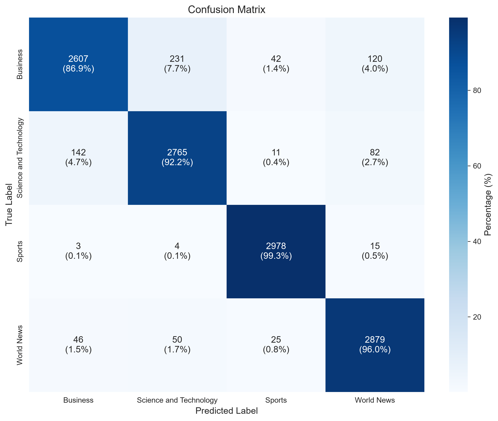
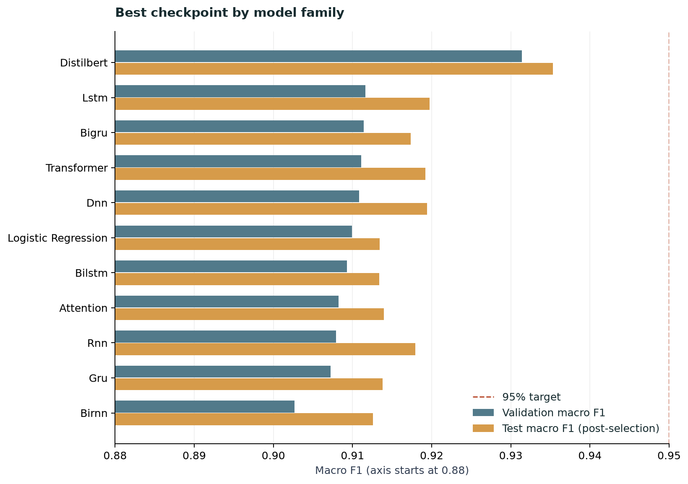
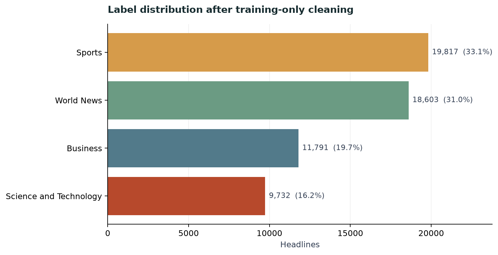
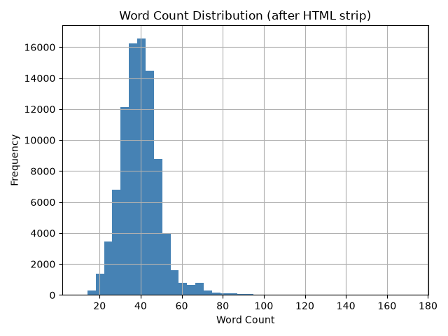
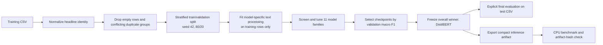
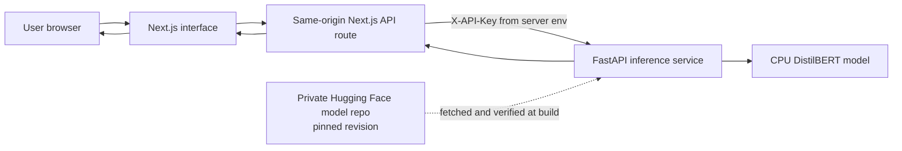
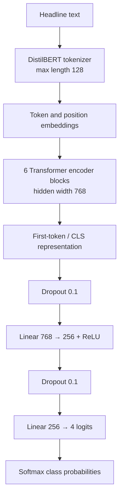

# News Topic Classification

An end-to-end news-headline classifier that predicts **Business**, **Science and Technology**, **Sports**, or **World News**. The project includes a validation-driven model-comparison workflow, an evaluated DistilBERT model, a FastAPI inference service, and a Next.js web application deployed as separate Vercel projects.

<p align="center">
  <a href="https://multi-class-news-topic-classification.vercel.app/">Open the web app</a>
  &nbsp;·&nbsp;
  <a href="https://github.com/Nowshin-Ara-Nini">GitHub profile</a>
  &nbsp;·&nbsp;
  <a href="https://github.com/Nowshin-Ara-Nini/Multi-Class-News-Topic-Classification">Source repository</a>
</p>

> **Current result:** the deployed DistilBERT artifact scored **93.53% macro F1** on the supplied 12,000-row test CSV. The 95% macro-F1 goal was not reached. This test CSV has also been used in earlier project comparisons, so treat it as a **previously used benchmark**, not an untouched holdout.

## Contents

- [Overview](#overview)
- [Results](#results)
- [Exploratory data analysis](#exploratory-data-analysis)
- [Project architecture](#project-architecture)
- [Models and selection](#models-and-selection)
- [Data and evaluation protocol](#data-and-evaluation-protocol)
- [Run locally](#run-locally)
- [Deploy on Vercel](#deploy-on-vercel)
- [API reference](#api-reference)
- [Repository layout](#repository-layout)
- [Limitations and responsible interpretation](#limitations-and-responsible-interpretation)
- [Credits and license](#credits-and-license)

## Overview

The app classifies one headline or a batch of headlines and displays the predicted topic, class probabilities, model metadata, and evaluation results. The browser talks to a same-origin Next.js route, which authenticates server-to-server requests to the FastAPI service; API credentials are kept in Vercel environment variables and are not sent to the browser.

The training workflow compares classical, recurrent, attention-based, custom Transformer, and pretrained Transformer approaches. It selects checkpoints with **validation macro F1**. The supplied test CSV is opened only by explicit final-evaluation commands; it is not used to fit text processing, select architectures, tune hyperparameters, or choose the serving checkpoint.

| Component | Implementation |
|---|---|
| Web application | Next.js App Router, React, TypeScript |
| Inference API | FastAPI and Pydantic |
| Selected model | Fine-tuned `distilbert-base-uncased` |
| Training and evaluation | PyTorch, Transformers, scikit-learn |
| Model artifact storage | Private Hugging Face repository, pinned to a commit revision |
| Hosting | Separate Vercel projects for `web/` and `deploy/vercel-api/` |

## Results

### Exact deployed artifact

The serving artifact is the validation-selected DistilBERT checkpoint. Its model card, deployment benchmark, and final test report refer to the same artifact SHA-256.

| Metric | Result |
|---|---:|
| Validation macro F1 | **93.14%** |
| Test macro F1 | **93.53%** |
| Test macro-F1 bootstrap 95% CI | 93.08%–93.92% |
| Test accuracy | **93.58%** |
| Test macro ROC-AUC | 99.07% |
| Matthews correlation coefficient | 0.9146 |
| Test examples | 12,000 (3,000 per class) |
| Parameters | 66,560,772 |
| Exported artifact size | 253.94 MB |
| Artifact SHA-256 prefix | `ad51c1ac6b2c` |

Macro F1 weights each class equally, making it useful when class frequencies differ. Scores below are rounded from the saved reports.

| Class | Precision | Recall | F1 | Support |
|---|---:|---:|---:|---:|
| Business | 93.17% | 86.90% | 89.93% | 3,000 |
| Science and Technology | 90.66% | 92.17% | 91.40% | 3,000 |
| Sports | 97.45% | 99.27% | 98.35% | 3,000 |
| World News | 92.99% | 95.97% | 94.46% | 3,000 |

The main remaining weakness is **Business recall**. The confusion matrix shows the most common Business errors are predictions as Science and Technology and World News.



### Comparison across selected model families

Each family checkpoint was chosen by validation macro F1. Test scores are reported after checkpoint selection; they must not be used to revise that selection. “Baseline validation” is the family’s initial screening score, and “Selected validation” is the best checkpoint retained by the tuning workflow.



| Model family | Baseline validation macro F1 | Selected validation macro F1 | Test macro F1 (post-selection) |
|---|---:|---:|---:|
| **DistilBERT** | 92.49% | **93.14%** | **93.53%** |
| LSTM | 90.12% | 91.16% | 91.97% |
| BiGRU | 90.47% | 91.14% | 91.73% |
| Custom Transformer | 91.11% | 91.11% | 91.92% |
| DNN | 91.08% | 91.08% | 91.94% |
| Logistic Regression | 90.54% | 90.99% | 91.34% |
| BiLSTM | 90.27% | 90.93% | 91.34% |
| Attention RNN | 90.08% | 90.82% | 91.40% |
| RNN | 89.25% | 90.79% | 91.79% |
| GRU | 90.31% | 90.72% | 91.38% |
| BiRNN | 88.80% | 90.26% | 91.26% |

The tuning workflow improved the validation score for most families, but DistilBERT remained the top validation-selected checkpoint. Its test macro F1 is about **1.47 percentage points below** the 95% target.

### Local CPU deployment benchmark

The exported artifact passed the project’s local serving benchmark. These figures were measured on the developer’s machine and are **not** Vercel production latency guarantees.

| Measurement | Result |
|---|---:|
| Peak process RSS | 1,271.43 MB |
| Cold initialization | 2.12 s |
| Warm prediction p95 | 72 ms |
| Ten-headline batch | 0.71 s |
| Validation macro-F1 change after export | 0.00 percentage points |
| Test data accessed by benchmark | No |

## Exploratory data analysis

The source training CSV contains **88,829 rows**. The training-only cleaning and duplicate-identity procedure retained **59,943 labeled headlines** for the reproducible experiment split. Nine headline-identity groups with conflicting labels were excluded. The class-distribution plot below uses that cleaned training data, before the 80/20 train/validation split.



The notebook’s headline-length analysis covers the original 88,829 training rows after HTML-tag removal and before the current duplicate/conflict filtering. Headline length is measured in whitespace-separated words.

| Headline word-count statistic | Value |
|---|---:|
| Mean | 40.08 |
| Median | 40 |
| 25th–75th percentile | 34–45 |
| Minimum–maximum | 10–172 |



The label distribution is moderately imbalanced: Sports is the largest cleaned class (33.1%) and Science and Technology the smallest (16.2%). The training configuration enables class weighting for neural models. The length distribution is concentrated around roughly 30–50 words, with a thinner long-headline tail; the selected DistilBERT tokenizer truncates/pads to 128 tokens.

The committed figures can be refreshed from saved run artifacts with:

```powershell
python scripts/render_readme_assets.py
```

This script reads the saved split manifest, model comparison report, and final confusion-matrix image. It does not load a dataset or run model evaluation.

## Project architecture

### Training, selection, and evaluation



### Serving architecture



The private model files are fetched and hash-verified while building the API project. The deployed API serves the pinned artifact locally and does not download model weights for each request. The Next.js API route keeps the inference key server-side and forwards only approved routes.

### Selected DistilBERT structure

The deployed model fine-tunes the uncased DistilBERT base encoder, pools the first (`[CLS]`) token, then applies a small four-class head.



The base encoder is **not frozen**. The selected run used AdamW, encoder learning rate `3e-5`, batch size 16 with 2-step gradient accumulation, weight decay `0.01`, linear warmup, mixed precision, early stopping, and seed 42. The best checkpoint was saved at epoch 3. Training hyperparameters are recorded in the run configuration and model card.

## Models and selection

The experiment compares eleven families. All use the same cleaned training data and saved stratified split; model-specific tokenizers/features are fitted from training rows only.

| Family | Structure / representation |
|---|---|
| Logistic Regression | TF-IDF lexical features; regularization and preprocessing variants searched |
| DNN | TF-IDF input, configurable dense layers; tuned variant supports residual blocks and normalization |
| RNN / BiRNN | Word2Vec sequence embeddings with recurrent encoder and compact classifier head |
| GRU / BiGRU | Gated recurrent sequence encoders |
| LSTM / BiLSTM | Long short-term memory sequence encoders |
| Attention | Recurrent encoder with additive attention pooling |
| Custom Transformer | Word2Vec embeddings, positional encoding, multi-head Transformer encoder, pooling head |
| DistilBERT | Fine-tuned pretrained Transformer with `[CLS]` classification head |

The search compares raw, optimum, and extreme preprocessing variants where supported, then searches family-specific architectural and optimization settings. Checkpoints are ranked by validation macro F1; the frozen overall winner is exported for deployment. The test score is a final report, not a selection criterion.

## Data and evaluation protocol

The dataset files are intentionally excluded from Git. Place the supplied CSVs in `data/` locally; the expected columns are `News Headline` and `News Topic`.

| Dataset | Rows | Use |
|---|---:|---|
| `Training_data_9.csv` | 88,829 original rows | Training, model development, and validation |
| Cleaned training records | 59,943 | Deduplicated, non-empty records used for the reproducible split |
| Training partition | 47,954 | Fit text transforms and model weights |
| Validation partition | 11,989 | Early stopping and model/hyperparameter selection |
| `Test_data.csv` | 12,000 | Explicit post-selection evaluation only |

The split manifest is created from the training CSV alone and records the source checksum, seed, cleaning version, and split indices. Cleaning normalizes headline identity (Unicode normalization, HTML unescaping/tag removal, case folding, and tokenized identity), removes empty rows, excludes identity groups with conflicting labels, and keeps one row per remaining identity. The source CSVs are not modified.

**Test-set caveat:** the current tuning workflow does not read the test CSV. However, this repository includes older baseline reports that already evaluated many model variants on the same supplied test CSV. Therefore, the reported 93.53% is a useful project benchmark but should not be presented as an independent, untouched holdout result. For a new unbiased model-selection estimate, collect a fresh test set or use a suitable nested evaluation protocol.

## Run locally

### Requirements

- Python 3.12
- Node.js 20.9 or newer for the website
- CUDA-enabled PyTorch is optional; CPU training is supported but slower
- The supplied CSV files placed under `data/`

Create a Python environment and install dependencies from the repository root:

```powershell
python -m venv .venv
.\.venv\Scripts\Activate.ps1
python -m pip install -r requirements.txt
```

### Tune using training data only

```powershell
python main.py tune --config configs/improve.yaml --budget-hours 24 --output results/improvement
```

Use a new output directory when changing data or configuration. The tuning command does not open `Test_data.csv`. Its output includes a split manifest, trial configurations, validation metrics, and a validation-selected `selection.json`.

For a single model-family training run:

```powershell
python main.py train --config configs/improve.yaml --model distilbert --preprocessing raw
```

### Export and benchmark the selected checkpoint

```powershell
$selection = Get-Content results/improvement/selection.json -Raw | ConvertFrom-Json
python main.py export --selection results/improvement/selection.json --output deploy/vercel-api/model
python main.py benchmark --model deploy/vercel-api/model --reference $selection.model_dir
```

The benchmark uses validation data only. Export to a new, empty directory; benchmark must pass before publishing. The benchmark verifies artifact identity and reports memory, cold/warm latency, batch latency, and validation-score change.

### Evaluate the frozen model on the supplied test CSV

Run this only after model selection and export are frozen:

```powershell
python main.py evaluate-selected --selection results/improvement/selection.json --data data/Test_data.csv --output results/final_test
python main.py evaluate --model deploy/vercel-api/model --data data/Test_data.csv --output results/deployed_test --device cpu
```

The first command evaluates the selected checkpoint for each family. The second measures the exact exported serving artifact. Evaluation does not alter the winner. Reports include macro F1, accuracy, per-class precision/recall/F1, confusion matrix, ROC and precision-recall curves, error analysis, and a bootstrap confidence interval.

### Run the API and website locally

Start the API from the repository root after exporting the model:

```powershell
$env:MODEL_DIR = "deploy/vercel-api/model"
$env:API_KEY = "use-a-long-random-local-secret"
python -m uvicorn api.main:app --host 127.0.0.1 --port 8000
```

In another terminal, configure and start the frontend:

```powershell
Set-Location web
Copy-Item .env.example .env.local
npm install
npm run dev
```

Set `INFERENCE_API_URL=http://127.0.0.1:8000` and `INFERENCE_API_KEY` to the same local secret as `API_KEY` in `web/.env.local`. Open `http://localhost:3000`. Never commit `.env.local` or expose secrets through `NEXT_PUBLIC_` variables.

## Deploy on Vercel

Deploy the API and website as **two projects from the same GitHub repository**:

1. API project root directory: `deploy/vercel-api/`.
2. Frontend project root directory: `web/`.
3. Publish the exported model directory to a private Hugging Face model repository, preserving its full folder structure, then use the immutable repository revision in the API environment.
4. Add the environment variables below for Preview and Production, then deploy each project.

| API project variable | Purpose |
|---|---|
| `API_KEY` | Long random request-authentication secret |
| `MODEL_REPO_ID` | Private Hugging Face model repository ID |
| `MODEL_REVISION` | Full immutable commit SHA for the model files |
| `HF_TOKEN` | Read token allowing the build to download the private artifact |
| `VERCEL_SUPPORT_LARGE_FUNCTIONS` | Set to `1` for eligible projects that need the larger Python function bundle limit |

| Frontend project variable | Purpose |
|---|---|
| `INFERENCE_API_URL` | API deployment base URL, without `/docs` or an endpoint path |
| `INFERENCE_API_KEY` | Same value as the API project’s `API_KEY` |
| `INFERENCE_VERCEL_BYPASS_SECRET` | Optional; only when API deployment protection requires a bypass secret |

After changing environment variables, redeploy the affected project so the new values are available to its functions. Keep API keys and Hugging Face tokens in Vercel settings; never commit or publish them. The API build downloads and verifies the model; inference uses the pinned artifact bundled with the API deployment.

## API reference

All routes except `/health` require the `X-API-Key` header in Vercel. The website adds this header in its server-side proxy.

| Method | Route | Purpose |
|---|---|---|
| `GET` | `/health` | Liveness status and whether the model is loaded |
| `GET` | `/ready` | Authenticated readiness check; loads/checks the model |
| `POST` | `/predict` | Classify one headline, up to 5,000 characters |
| `POST` | `/batch_predict` | Classify up to 100 headlines |
| `GET` | `/model/info` | Architecture, classes, metrics, and artifact metadata |
| `GET` | `/model/version` | API version and artifact hash |
| `GET` | `/models` | Read-only comparison across selected model families |
| `GET` | `/docs` | FastAPI interactive API documentation |

## Repository layout

```text
.
├── api/                    # Local FastAPI import entry point
├── configs/                # Default and model-improvement configurations
├── data/                   # Local CSVs (ignored by Git)
├── deploy/
│   └── vercel-api/          # Vercel FastAPI project; model fetched at build
├── docs/assets/             # Committed README visualizations
├── legacy/                 # Archived Streamlit application
├── notebooks/              # Exploratory notebook and original EDA figure
├── scripts/                # Model publishing and README figure utilities
├── src/
│   ├── models/              # Classical, neural, recurrent and Transformer models
│   ├── training_data.py     # Training-only cleaning and split manifest
│   ├── tuning.py            # Candidate search and selection workflow
│   ├── evaluation.py        # Metrics and evaluation plots
│   └── inference.py         # Checkpoint loading and prediction pipeline
├── tests/                  # Unit and workflow tests
└── web/                    # Next.js UI and authenticated API proxy
```

## Limitations and responsible interpretation

- The 95% macro-F1 goal has **not** been met; the selected test benchmark is 93.53%.
- The supplied test CSV has been used in earlier project comparisons, so it is not an untouched holdout.
- Headline topic prediction does not establish the truth, quality, political position, or reliability of a news story.
- Confidence values are model scores, not calibrated probabilities or guarantees.
- The model was trained and evaluated on a specific four-class headline dataset; performance may change on other publishers, languages, time periods, or longer articles.
- The Vercel benchmark above is local. Monitor cold starts, request errors, and live latency after deployment.

## Credits and license

Developed by [Nowshin Ara Nini](https://github.com/Nowshin-Ara-Nini) as an educational CSE 440 project. The project uses pretrained DistilBERT and Google News Word2Vec resources. Licensed under the [MIT License](LICENSE).
