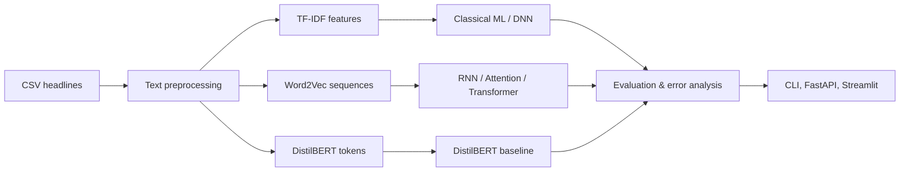

# 📰 News Topic Classification

> A production-grade NLP system for classifying news headlines into topic categories using classical ML and deep learning approaches.

[](https://www.python.org/downloads/)
[](https://pytorch.org/)
[](LICENSE)

---

## 🎯 Overview

This project classifies news headlines into **4 categories**:

| Category | Icon | Description |
|----------|------|-------------|
| **Business** | 💼 | Corporate news, markets, finance |
| **Science and Technology** | 🔬 | Scientific discoveries, tech innovations |
| **Sports** | ⚽ | Athletic competitions, player news |
| **World News** | 🌍 | International events, politics |

Trained on **88,000+ headlines**, the project reports metrics from the held-out
test set through `python main.py evaluate`. Do not treat validation scores as
test scores: the current audited sparse baseline reaches **92.36% accuracy**
and **92.33% macro F1** on the provided 12,000-row test set. A verified 95%
result has not yet been achieved.

---

## 🏗️ Architecture



```
project/
├── configs/                    # Configuration management
│   ├── config.py              # Dataclass-based config
│   └── default.yaml           # Default hyperparameters
├── src/                       # Core source code
│   ├── preprocessing.py       # Text preprocessing pipeline
│   ├── datasets.py            # Dataset & vocabulary management
│   ├── embeddings.py          # Feature extraction (TF-IDF, Word2Vec)
│   ├── models/                # Model architectures
│   │   ├── classical.py       # Logistic Regression
│   │   ├── dnn.py             # Feed-forward DNN
│   │   ├── rnn.py             # RNN/GRU/LSTM (uni + bi)
│   │   ├── attention.py       # BiLSTM + Attention
│   │   └── transformer.py     # Transformer Encoder
│   ├── trainer.py             # Unified training pipeline
│   ├── evaluation.py          # Metrics & visualization
│   ├── error_analysis.py      # Error analysis utilities
│   └── inference.py           # Production inference
├── app/                       # Streamlit web app
├── api/                       # FastAPI REST API
├── notebooks/                 # Jupyter notebooks
├── data/                      # Dataset files
├── saved_models/              # Trained model checkpoints
├── results/                   # Evaluation results & plots
├── main.py                    # CLI entry point
├── requirements.txt           # Dependencies
├── Dockerfile                 # Container deployment
└── README.md                  # This file
```

---

## 🚀 Quick Start

### 1. Installation

```bash
# Clone the repository
git clone <repo-url>
cd project

# Create virtual environment
python -m venv .venv
.venv\Scripts\activate  # Windows
# source .venv/bin/activate  # Linux/Mac

# Install dependencies
pip install -r requirements.txt
```

The first DistilBERT run downloads `distilbert-base-uncased` from Hugging Face.
If your network blocks `huggingface.co`, download the complete model snapshot on
another connected machine, copy it into this project (for example,
`models/distilbert-base-uncased/`), and set `distilbert.model_name` in your
training YAML to that local directory.

Or use Conda:

```bash
conda create -n news-classifier python=3.12 -y
conda activate news-classifier
pip install -r requirements.txt
```

### 2. Prepare Data

Place your dataset files in the `data/` directory:
- `data/Training_data_9.csv`
- `data/Test_data.csv`

### 3. Train Models

```bash
# Train all models with default configuration
python main.py train --config configs/default.yaml

# Quick smoke test (2 epochs, 1000 samples)
python main.py train --config configs/default.yaml --quick-test

# Train a specific model
python main.py train --model bilstm --preprocessing optimum --features word2vec

# Train with all preprocessing modes
python main.py train --preprocessing all --features all
```

### 4. Evaluate

```bash
python main.py evaluate --model saved_models/bilstm_optimum_word2vec/
```

### 5. Predict

```bash
# Single prediction
python main.py predict --model saved_models/best_model/ --text "Apple reports record revenue"

# Batch prediction from file
python main.py predict --model saved_models/best_model/ --file headlines.txt --output results.json
```

---

## 🌐 Deployment

### Streamlit Web App

```bash
python -m streamlit run app/streamlit_app.py
```

The deployed Streamlit app is pinned to the compact TF-IDF Logistic Regression
checkpoint in `app/model/`; it does not require Word2Vec or Gensim.

### FastAPI REST API

```bash
# Start API server
MODEL_DIR=saved_models/best_model uvicorn api.main:app --host 0.0.0.0 --port 8000

# View API docs
# http://localhost:8000/docs
```

### Docker

```bash
docker build -t news-classifier .
docker run -p 8000:8000 -v ./saved_models:/app/saved_models news-classifier
```

---

## 📊 Models & Results

### Model Comparison

| Model | Features | Preprocessing | Accuracy | Macro F1 |
|-------|----------|---------------|----------|----------|
| Word + character Linear SVM | TF-IDF | Raw | 0.9236 | 0.9233 |
| Existing Transformer checkpoint | Validation only | Raw | 0.9280 | 0.9160 |

The second row is retained only as a historical validation result from the
repository. Re-run evaluation on `data/Test_data.csv` before presenting any
model as a final result.

### Model Details

| Architecture | Parameters | Input | Key Features |
|-------------|------------|-------|--------------|
| **LogisticRegression** | ~80K | TF-IDF (20K) | LBFGS solver, L2 regularization |
| **DNN** | ~1.3M | TF-IDF (20K) | 256→128→64, Dropout 0.4 |
| **BiLSTM** | ~854K | Word2Vec (300d) | 2-layer, mean+max pooling, LayerNorm |
| **Attention** | ~900K | Word2Vec (300d) | BiLSTM + self-attention |
| **Transformer** | ~1.5M | Word2Vec (300d) | 4-layer encoder, positional encoding |

---

## ⚙️ Configuration

All hyperparameters are centralized in `configs/default.yaml`:

```yaml
# Key settings
training:
  epochs: 15
  batch_size: 64
  learning_rate: 0.0003
  early_stopping: true
  patience: 4
  gradient_clip: 5.0

rnn:
  cell_type: "lstm"
  hidden_size: 256
  num_layers: 2
  bidirectional: true
  pooling: "mean_max"
```

---

## 🔬 Preprocessing Pipelines

| Mode | Description | Operations |
|------|-------------|------------|
| **Raw** | No processing | Strip whitespace only |
| **Extreme** | Heavy cleaning | Remove HTML, lowercase, remove all special chars/numbers, remove stopwords, lemmatize |
| **Optimum** | Balanced | Remove HTML, lowercase, expand contractions, controlled cleaning, selective stopword removal, lemmatize |

---

## 📁 API Reference

### `POST /predict`
Example request:

```bash
curl -X POST http://localhost:8000/predict \
  -H "Content-Type: application/json" \
  -d "{\"text\": \"Apple reports record quarterly revenue\"}"
```

```json
{
  "text": "Apple reports record quarterly revenue"
}
```

Response:
```json
{
  "success": true,
  "result": {
    "predicted_class": "Business",
    "confidence": 0.94,
    "probabilities": {
      "Business": 0.94,
      "Science and Technology": 0.03,
      "Sports": 0.01,
      "World News": 0.02
    }
  }
}
```

### `POST /batch_predict`
```json
{
  "texts": ["headline 1", "headline 2", "..."]
}
```

### `GET /health`
Returns API status and model information.

### `GET /model/info` and `GET /model/version`
Return the saved model card (when available) and deployed API/model version.
Set `API_KEY` in the environment to require an `X-API-Key` request header for
prediction endpoints.

---

## 🛠️ Development

### Project was refactored from a monolithic Jupyter notebook addressing:
- ✅ **30 identified issues** (duplicate code, magic numbers, missing docs, etc.)
- ✅ **6 duplicate training loops** → 1 unified `Trainer` class
- ✅ **14 copy-pasted plots** → 1 `Evaluator` class
- ✅ **6 separate RNN classes** → 1 parameterized `RecurrentClassifier`
- ✅ **TensorFlow dependency removed** (was used only for tokenization)
- ✅ **Full reproducibility** with seed management
- ✅ **Early stopping, LR scheduling, gradient clipping** added
- ✅ **Model checkpointing and inference pipeline** added

---

## Future Work

- Fine-tune the optional DistilBERT encoder on a GPU and compare it on the
  held-out test split.
- Add calibration analysis and confidence-threshold monitoring for deployed
  predictions.
- Publish experiment artifacts and model cards for each production candidate.

---

## 📄 License

This project is for educational and portfolio purposes.

---

## 🙏 Acknowledgments

- Dataset: AG News classification dataset
- Pre-trained embeddings: Google News Word2Vec (300d)
- Course: CSE 440

---

## Citation

If you build on this repository, please cite it as:

```text
Nowshin. News Topic Classification. CSE 440 portfolio project, 2026.
```
